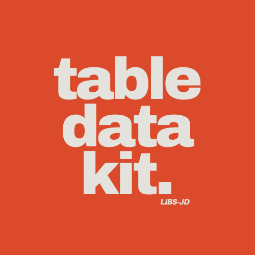

<div align="center">
</div>

# @libs-jd/table-data-kit [](https://badge.fury.io/js/@libs-jd%2Ftable-data-kit)

> Utility functions to work with table data.

## Install

Install with [npm](https://www.npmjs.com/):

```sh
$ npm install --save @libs-jb/table-data-kit
```

## Usage

From `@libs-jb/table-data-kit` we can use the following functions:

# `comparator` function

```js
const table1 = [
  ["Alice", "30", "alice@example.com"],
  ["Bob", "25", "bob@example.com"],
];

const table2 = [
  ["Alice", "30", "alice@example.com"],
  ["Bob", "25", "bob@example.com"],
];

const { comparator } = require("@libs-jb/table-data-kit");
const similar = comparator(table1, table2);

console.log(similar); // true / false
```

## About

<details>
<summary><strong>Contributing</strong></summary>

Pull requests and stars are always welcome. For bugs and feature requests, [please create an issue](../../issues/new).

</details>

### Author

**Jeet Dhandha**

- [LinkedIn Profile](https://linkedin.com/in/jeet-dhandha)
- [GitHub Profile](https://github.com/jeet-dhandha)

### License

Released under the [MIT License](LICENSE).
